# PRAVAH + LifeLane - System Flowchart

## 🚀 Overall System Architecture

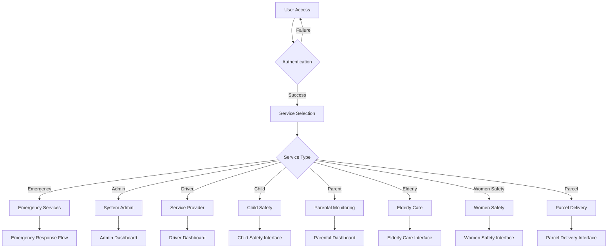

## 🚑 Emergency Response Flow

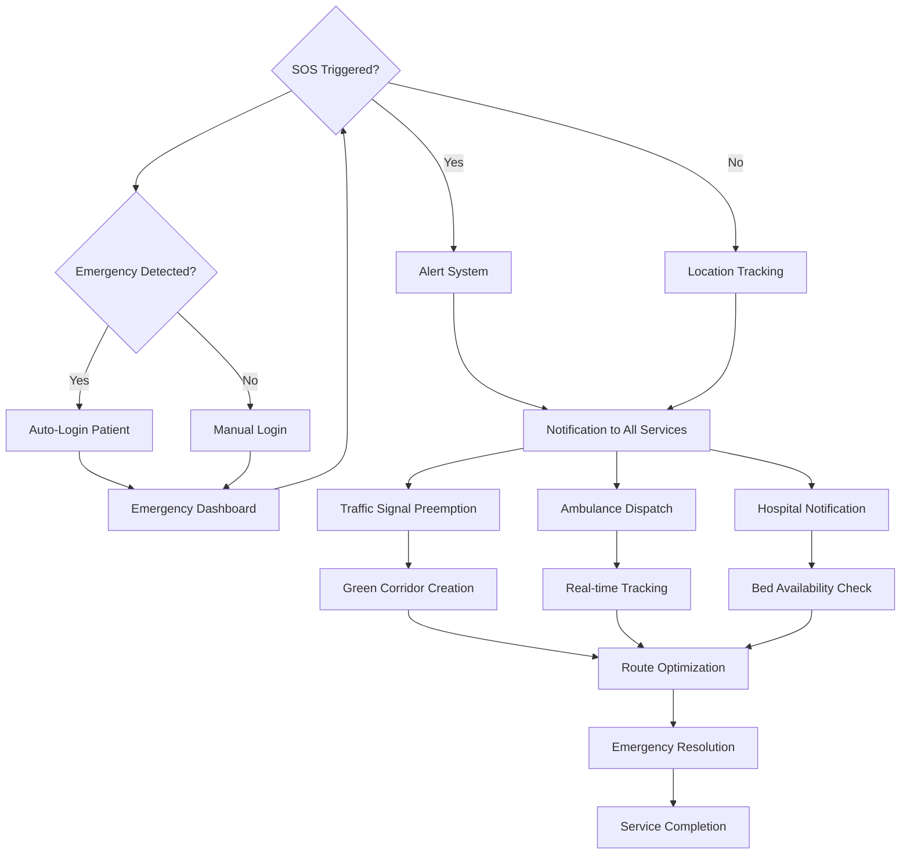

## 🚦 Traffic Management Flow

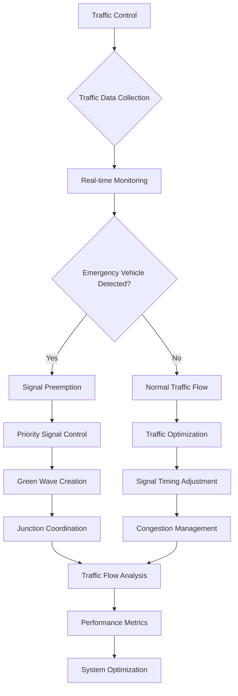

## 👥 Child Safety Flow

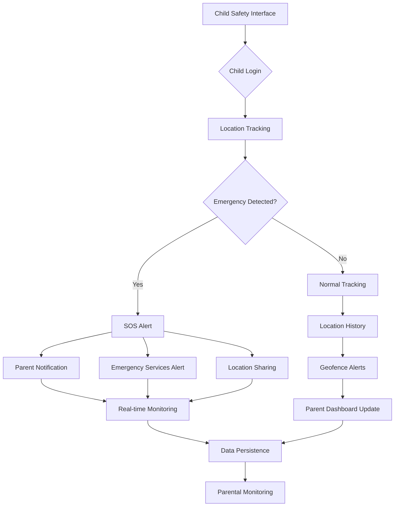

## 👨‍👩 Parental Monitoring Flow

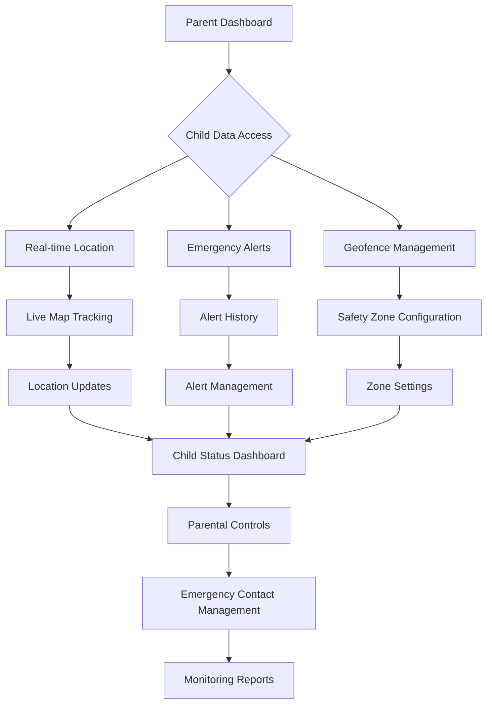

## 👴 Elderly Care Flow

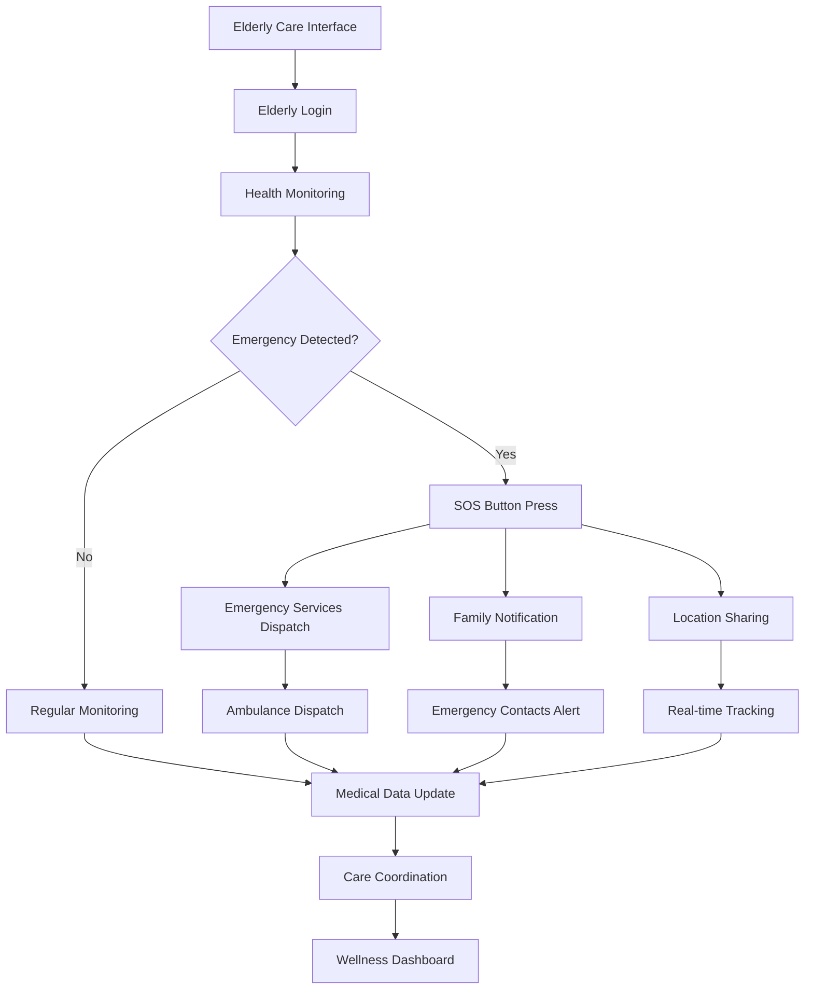

## 🚺 Women Safety Flow

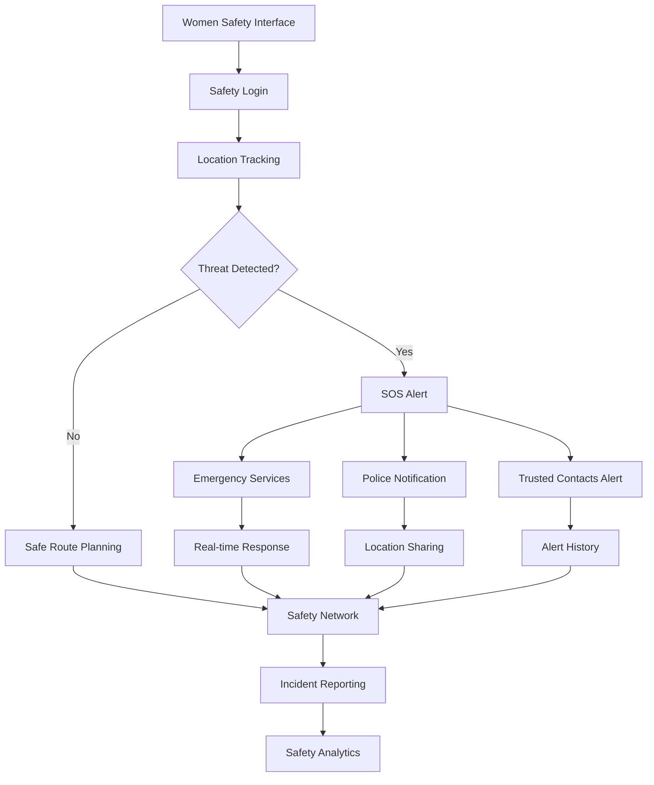

## 📦 Parcel Delivery Flow

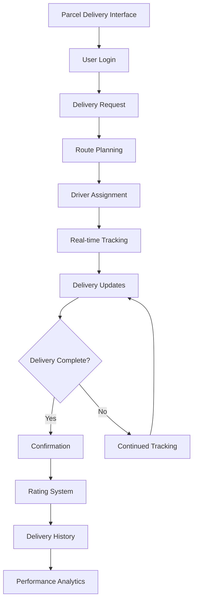

## 🗄️ Database Integration Flow

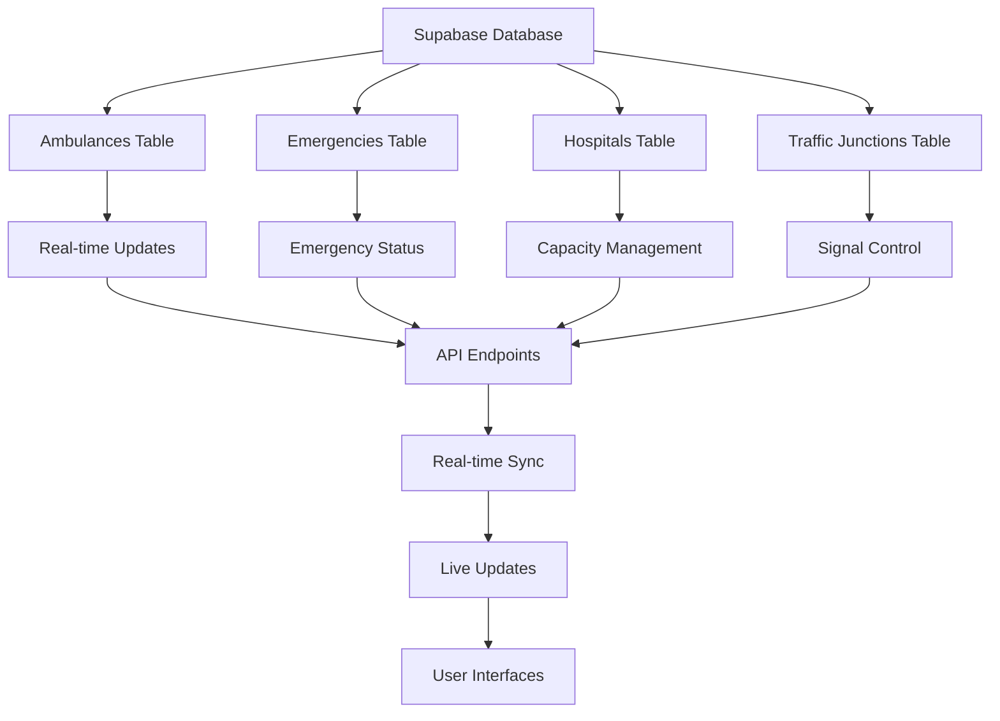

## 🔄 Real-time Communication Flow

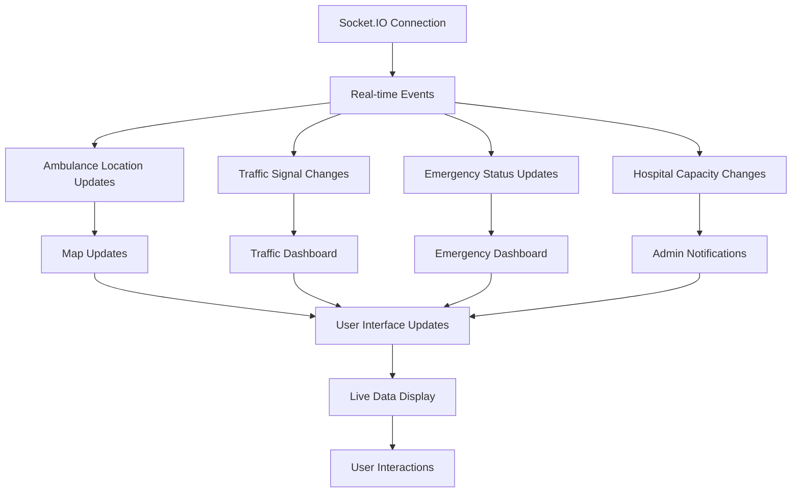

## 🌍 Location Services Flow

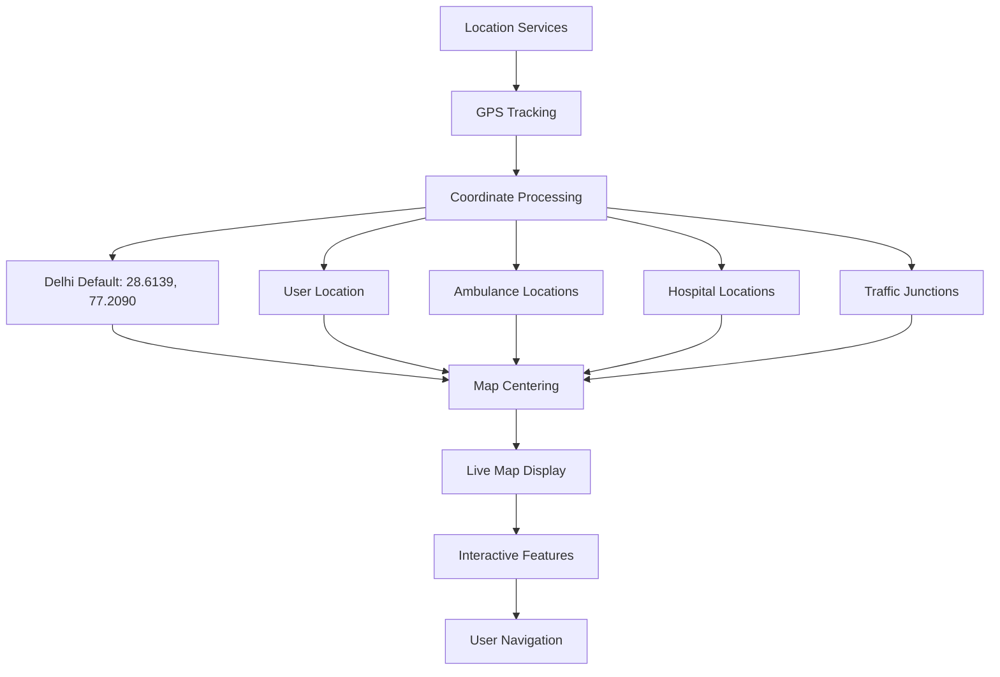

## 🎯 System Success Metrics Flow

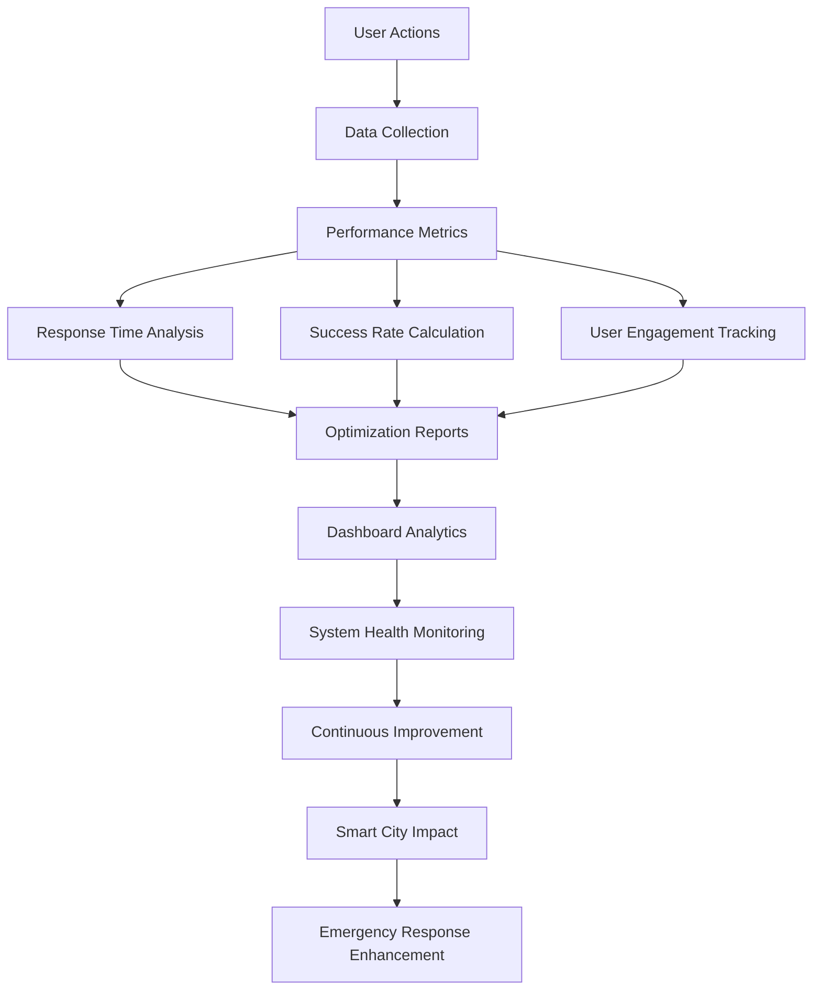
